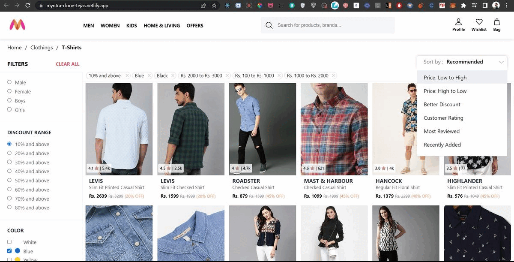

Here’s a beautiful, modernized, and more engaging version of your README file for the Myntra Clone project:

---

````markdown
# 🛍️ Myntra Clone

A feature-rich, pixel-perfect clone of the popular fashion e-commerce platform **Myntra**, built with **React**, **Redux**, and **CSS**.

<p align="center">
  <a href="https://myntra-clone-tejas.netlify.app/" target="_blank">
    
  </a>
</p>

## 🚀 Live Project

🔗 [Live Website](https://myntra-clone-tejas.netlify.app/)  
📽️ [Video Demo](https://drive.google.com/file/d/1inz0klV3BUnM517INqFhtWN3311-qXE5/view?usp=share_link)

---

## ✨ Features

- 🔍 **Advanced Filtering** — Filter products by gender, color, discount range, and price.
- 📊 **Sorting Options** — Sort items by price, discount, ratings, and reviews.
- 🛒 **Add to Bag** — Seamless shopping cart experience with real-time updates.
- 💖 **Wishlist** — Save your favorite items for future purchases.
- 👀 **View Similar Products** — Discover alternatives related to your selected item.
- 🔎 **Search Bar** — Find products quickly using intuitive keyword-based search.

---

## 🧰 Tech Stack

- **Frontend:** React, Redux, HTML5, CSS3
- **State Management:** Redux
- **Routing:** React Router
- **Styling:** CSS Modules / Custom Styles

---

## 📦 Getting Started

Follow these steps to run the project locally:

```bash
# 1. Clone the repo
git clone https://github.com/tm2k23/myntra.git

# 2. Navigate to project directory
cd myntra

# 3. Install dependencies
npm install

# 4. Start the development server
npm start

# Visit the app at http://localhost:3000
````

---

## 🚢 Deployment

Before deploying, create a production build:

```bash
npm run build
```

Then deploy to your preferred hosting platform (e.g., Netlify, Vercel, GitHub Pages).

---

## 📸 Screenshots (Optional)

*Add relevant UI screenshots here to visually showcase your project.*

---

## 🙌 Acknowledgements

This project is inspired by **Myntra** — a leading Indian fashion e-commerce site. Built for learning purposes and improving frontend architecture skills.

---

## 🧑‍💻 Author

**Debprasad Manna**
🧑‍🎓 MCA, 2025 Batch | 🎓 BCA, 2023 (CGPA: 9.32)

---

## 📫 Contact

Feel free to connect for collaboration or feedback:

* 🌐 [Portfolio](#)
* 📧 Email: [youremail@example.com](mailto:youremail@example.com)
* 💼 [LinkedIn](#)
* 🐱 [GitHub](https://github.com/tm2k23)

---

> Made with ❤️ by Debprasad Manna

```

```
