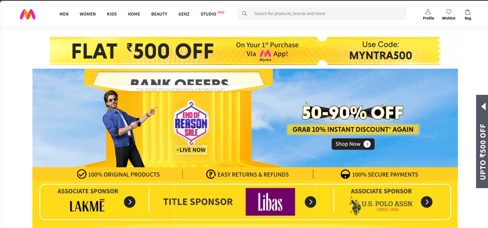
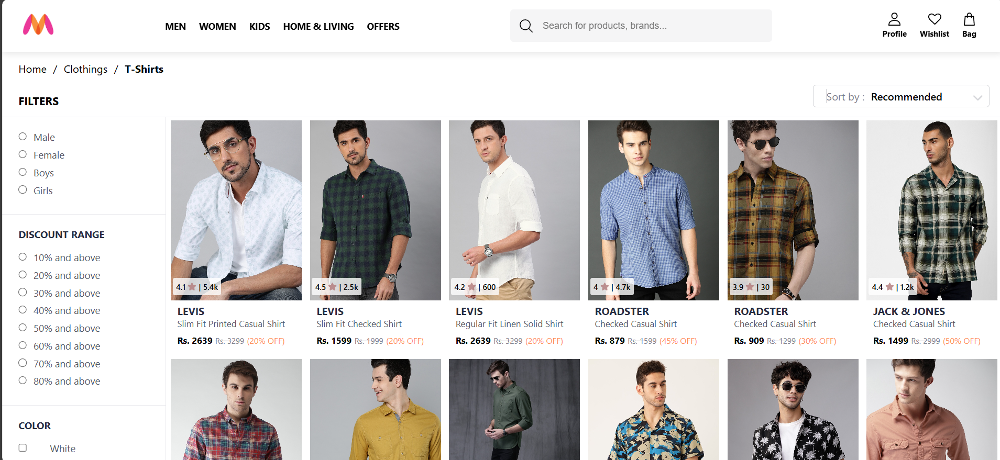
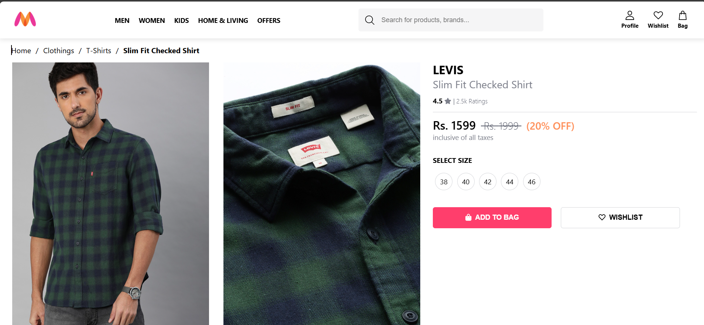
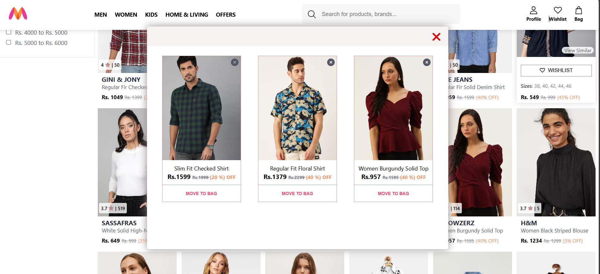

---

# 🛍️ Myntra Clone – E-Commerce Web App

> A fully responsive and modern **Myntra-inspired fashion e-commerce web application**, built with **React**, **Redux**, and **Tailwind CSS**, designed to mimic the sleek look, feel, and core features of India's most popular fashion platform.



---

## 🚀 Live Demo

🔗 [**Click Here to Explore the Myntra Clone**](https://your-deployment-url.com)
📱 Optimized for all screen sizes — mobile, tablet, and desktop

---

## 🌟 Features

* 🛍️ **Homepage with Category Banners**
* 👕 **Product Listings** with filters, sorting & pagination
* ❤️ **Wishlist Functionality** (Add/Remove)
* 🔍 **Live Search** with intelligent keyword matching
* 📄 **Product Detail Page** with “View Similar” recommendations
* 🔒 **Authentication System** (Login/Signup with JWT/Firebase)
* 🛒 **Cart Management** (Optional: Add if implemented)
* 📱 **Fully Responsive** design across all devices
* ⚙️ **Modern UI** inspired by Myntra's real interface

---

## 🧰 Tech Stack

**Frontend**
✔ React.js
✔ Redux Toolkit
✔ Tailwind CSS or Material UI
✔ React Router DOM
✔ Axios

**Backend** (if included)
✔ Node.js
✔ Express.js
✔ MongoDB / Firebase

**Other Tools**
✔ Cloudinary (Image hosting)
✔ JWT / Firebase Auth
✔ Vercel / Netlify (Deployment)

---

## 📸 Screenshots

| Homepage                                     | Product Listing                                    | Product Detail                                   |
| -------------------------------------------- | -------------------------------------------------- | ------------------------------------------------ |
|  |  |  |

| Wishlist                                             | 
| ---------------------------------------------------- |
|  | 

---

## 📦 Installation & Setup

```bash
# 1. Clone the repositoryhttps://github.com/youruser
git clone https://github.com/Debprasad77/Myntra_Clone.git
cd Myntra_Clone

# 2. (optional) Npm initialization
npm init

# 3. Start project
npm start

```

> 💡 Environment variables like API keys or Cloudinary config should be placed in a `.env` file.

---

## 🧠 Project Structure

```
Myntra-Clone/
│
|── public
|
|
├── src/                # React frontend
│   ├── components/        # Reusable UI components
│   ├── pages/             # Route pages
│   ├── redux/             # Redux store & slices
│   └── assets/            # Images, icons, etc.
│
└── README.md
```

---

## 🙋‍♂️ About Me

**Debprasad Manna**
🧑‍💻 Web Developer

💼 Passionate about UI/UX & full-stack development

🌐 [Portfolio Website](https://debprasadportfolio.vercel.app)

📫 Reach me at: [debprasad7047@gmail.com](mailto:debprasad7047@gmail.com)

---

## 📣 Feedback & Contributions

Have ideas or found a bug?
Feel free to [open an issue](https://github.com/Debprasad77/Myntra_Clone/issues) or submit a pull request!

---

## ⭐ Support

If you liked this project, don’t forget to:

* ⭐ Star this repository
* 🛠️ Fork it to build your own version
* 🧑‍💻 Connect on [LinkedIn](https://www.linkedin.com/in/debprasad77/)

---

## 📝 Rights

All rights Reserve to @Debprasad Manna .2025
---

